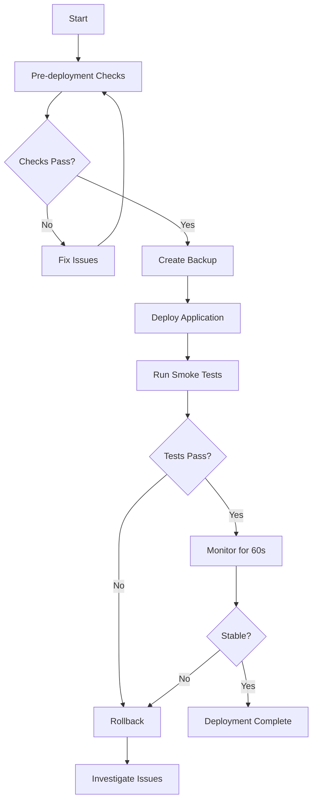

# Deployment Runbook for Protokol57

## 🎯 Objective
Ensure smooth, reliable deployments every time with zero downtime and quick rollback capability.

## 🚀 Quick Start

For the safest deployment experience:
```bash
./deploy-with-safety.sh
```

This script handles everything automatically:
- Pre-deployment checks
- Backup creation
- Deployment execution
- Smoke tests
- Monitoring
- Rollback if needed

## 📋 Deployment Checklist

### Before Deployment
- [ ] All code changes committed
- [ ] Tests passing locally
- [ ] TypeScript compilation successful
- [ ] Environment variables updated
- [ ] Team notified of deployment

### During Deployment
- [ ] Pre-deployment checks pass
- [ ] Backup created
- [ ] Old container gracefully stopped
- [ ] New container started
- [ ] Health checks passing
- [ ] Smoke tests pass

### After Deployment
- [ ] Monitor logs for 5 minutes
- [ ] Check error tracking
- [ ] Verify key features work
- [ ] Update deployment log
- [ ] Notify team of completion

## 🛠️ Deployment Scripts

### 1. **deploy-with-safety.sh** (Recommended)
The master deployment script that runs all checks:
```bash
./deploy-with-safety.sh
```

Features:
- Runs pre-deployment checklist
- Creates automatic backup
- Choice of deployment method
- Runs smoke tests
- Monitors for errors
- Provides rollback option

### 2. **pre-deployment-check.sh**
Validates everything before deployment:
```bash
./pre-deployment-check.sh
```

Checks:
- Git status clean
- Required files exist
- Environment variables set
- TypeScript compiles
- SSH access works
- Current production healthy

### 3. **deploy-zero-downtime.sh**
Blue-green deployment with no downtime:
```bash
./deploy-zero-downtime.sh
```

Process:
1. Builds new container (green)
2. Starts alongside old (blue)
3. Validates health
4. Switches traffic
5. Stops old container

### 4. **deploy-production.sh**
Standard deployment (faster but has downtime):
```bash
./deploy-production.sh
```

### 5. **smoke-tests.sh**
Automated tests after deployment:
```bash
./smoke-tests.sh [URL]
```

Tests:
- Basic connectivity
- API endpoints
- Authentication
- Health monitoring
- Performance
- SSL certificate

### 6. **rollback.sh**
Quick rollback to previous version:
```bash
./rollback.sh
```

## 🔄 Standard Deployment Flow



## 🚨 Troubleshooting Guide

### Common Issues

#### 1. Pre-deployment Checks Fail
```bash
# Check specific failure
./pre-deployment-check.sh

# Common fixes:
git add . && git commit -m "Save changes"
git checkout main
git pull origin main
npm run check
```

#### 2. Container Won't Start
```bash
# Check logs
ssh root@69.62.126.73 'docker logs protokol57-protokol57-1'

# Check resources
ssh root@69.62.126.73 'docker stats --no-stream'

# Restart with more memory
# Edit docker-compose.prod.yml memory limits
```

#### 3. Health Checks Fail
```bash
# Test health endpoint
curl https://p57.birfoiz.uz/health

# Check database connection
curl https://p57.birfoiz.uz/ready

# View detailed metrics
curl https://p57.birfoiz.uz/metrics
```

#### 4. Smoke Tests Fail
```bash
# Run specific test
./smoke-tests.sh https://p57.birfoiz.uz

# Check specific endpoint
curl -v https://p57.birfoiz.uz/api/protocols
```

## 📊 Monitoring Commands

### Real-time Logs
```bash
ssh root@69.62.126.73 'docker logs -f protokol57-protokol57-1'
```

### Container Stats
```bash
ssh root@69.62.126.73 'docker stats protokol57-protokol57-1'
```

### Health Status
```bash
watch -n 5 'curl -s https://p57.birfoiz.uz/health | jq .'
```

### Error Grep
```bash
ssh root@69.62.126.73 'docker logs protokol57-protokol57-1 2>&1 | grep -i error'
```

## 🔐 Security Checklist

Before each deployment:
- [ ] No secrets in code
- [ ] Environment variables secured
- [ ] Dependencies updated
- [ ] Security headers enabled
- [ ] SSL certificates valid

## 📝 Deployment Log Template

```markdown
## Deployment Log - [DATE]

**Deployed by**: [Your Name]
**Version**: [Git commit hash]
**Start time**: [Time]
**End time**: [Time]

### Changes
- Feature: [Description]
- Fix: [Description]

### Issues Encountered
- [None / Description]

### Rollback Required
- [Yes/No]

### Notes
- [Any additional notes]
```

## 🆘 Emergency Procedures

### Complete Outage
1. Check server status: `ping 69.62.126.73`
2. SSH to server: `ssh root@69.62.126.73`
3. Check Docker: `systemctl status docker`
4. Restart container: `cd /opt/protokol57 && docker-compose -f docker-compose.prod.yml up -d`

### Rollback Failed
1. Use backup tag: `git checkout backup-[timestamp]`
2. Force rebuild: `docker-compose -f docker-compose.prod.yml build --no-cache`
3. Start fresh: `docker-compose -f docker-compose.prod.yml up -d`

### Database Issues
1. Check connection: `curl https://p57.birfoiz.uz/ready`
2. Verify credentials in `.env.production`
3. Test Supabase directly
4. App will use in-memory fallback automatically

## 📞 Contacts

- **Server SSH**: `ssh -i ~/.ssh/protokol57_ed25519 root@69.62.126.73`
- **Main Site**: https://p57.birfoiz.uz
- **Landing Page**: https://p57.uz
- **Monitoring**: https://p57.birfoiz.uz/metrics

## ✅ Best Practices

1. **Always run pre-deployment checks**
2. **Deploy during low-traffic hours**
3. **Monitor for at least 5 minutes after deployment**
4. **Keep deployment logs**
5. **Test rollback procedure regularly**
6. **Update this runbook with new learnings**

Remember: A smooth deployment is a boring deployment!